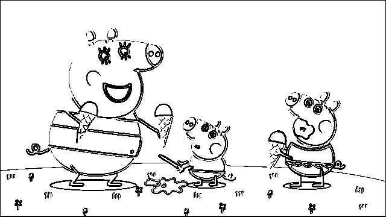
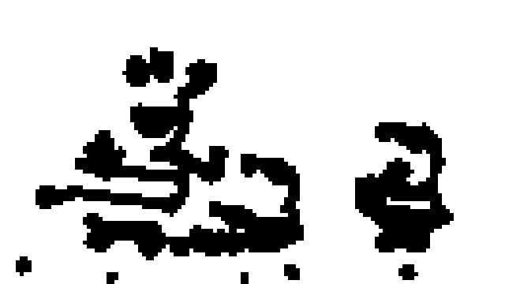
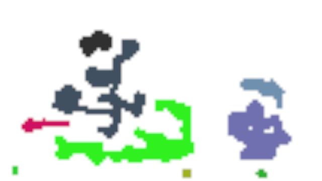
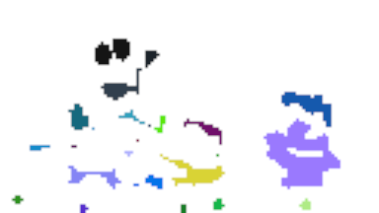

# Vision nursery for Harriet

The purpose of this service is to prepare Harriet's visual sensors. In `harriet-vision-nursery`, we process prepared images. We try to find distinct objects in these images. The goal is to identify set of objects in the image which correspond to what a human eye would focus on first. This service will work well only on simple images with few objects. Since Harriet is going to be taught with cartoons in the beginning, this limitation should not be too restraining.

Images result in object which we refer to as **highlights**. These highlights are persisted by the service into a Docker volume from where they can be picked up by other services. The hope is that eventually these highlights end up being analysed by Harriet's visual sensor.

## Running the service
Create the directory tree for artifacts if you run the service locally.
```
mkdir -p ~/.harriet/visual && \
mkdir -p ~/.harriet/visual/output && \
mkdir -p ~/.harriet/visual/input
```

Build the project with `cargo build --release`.

Run the docker compose with input and output directories.
```
HIGHLIGHTS_OUTPUT=/home/$USER/.harriet/visual/output \
IMAGES_INPUT=/home/$USER/.harriet/visual/input \
docker-compose up --build
```

## Algorithm
Video has to be split into images that are of given standard size. The algorithm assumes that the images are `640x360` pixels. The machine learning part will make no such assumptions and is only bound by the format of the output data from the algorithm. Therefore the algorithm can later on be replaced for a more sophisticated one should the model prove workable.

Let's go through the steps which the algorithm takes to identify highlights.

### Preparation
Single image is loaded from the dataset.


### Edge finding
The image is converted to grayscale and two filters are used on the image:

```
horizontal_edge_filter = [
  EDGE , EDGE , EDGE
  0    , 0    , 0
  -EDGE, -EDGE, -EDGE
]

vertical_edge_filter = [
  EDGE, 0, -EDGE
  EDGE, 0, -EDGE
  EDGE, 0, -EDGE
]
```

After applying these two filters, all pixel values that are not `0` or `255` for
black and white respectively are changed to `255` and values `0` and `255` are
changed to `0`.



### Object detection
To find the most important areas on the image a pixel density map is
built. The resolution of the resulting map is based on a `CELL_SIZE` setting.

Cell is a square that represents size*size pixels of the original image with
a single number. It is used to track density of edges. The larger the cell
size the lower the resolution of the heat map. The lower the cell size the
less abstract the heat map becomes. It has to be a number that is divides
both image width and image hight without a rest.

Ideally the learning process would decrease the `CELL_SIZE` with each re-watch.

#### Bricked heat map
Calculates the heat map of overlaying cells. Most pixels therefore belong
to 4 cells. Pixels on the edges of the image belong to 2 cells and pixels
in the corners belong to one cell.

In the following diagram, there are 4 cells where each cell is of the same
size (e.g. cell `0:0` contains `CELL_SIZExCELL_SIZE` pixels).

```
a: row 0, col 0
b: row 0, col 1
c: row 1, col 0
d: row 1, col 1

  ____0___________1_____
0 |   a    ab     b...
  |   ac   abcd   bd...
1 |   c... cd...  d...
```

#### Heat map
Transforms the bricked heat map where the cells are of `CELL_SIZE` to a more
granular one where cells are `CELL_SIZE / 2`. This gives us better detail
while preserving relationships between all parts of the image rather than
cropping out a block and calculating the heat separately.

#### Cellular automaton
Heat map has large range of values for each cell and contains lots of small
unimportant edges artifacts. The map is run through a cellular automaton with
three rules that decide based on a mean heat of cells Moore neighbourhood
whether a cell is killed, meaning it is not part of any of the most important
features, or kept alive. Cells that are killed (have heat of `0`) and that
reached maximum heat are stabilized (they cannot change their heat in following
cycles). Once all cells are stabilized, the automaton finishes.



#### Extracting highlighted areas
Automaton outputs a simple map of `on` and `off` points (each representing
`CELL_SIZE` * `CELL_SIZE` pixels). Using a flood and fill algorithm, we extract
divided areas into single `VisualObject`s. Those that pass a check for amount of
pixels they contain are directly as a single object. However, some of the objects
may be too large.

If an object doesn't pass the check, we create a peeled point map. That means we
set to `off` every pixel that does not have all of its neighbors `on`. Then this
cycle is repeated until all feature are smaller than the threshold.

By object, we mean a view into the original image that contains important info
worth analyzing further.

The number of objects found in the image and their size can be change with
`CELL_SIZE` parameter. Using smaller `CELL_SIZE` is like focusing on the image
in more depth, as it finds more objects which are very granular.

Consider following results of the algorithm:


- `CELL_SIZE: 14px`
- objects found: **7**


- `CELL_SIZE: 12px`
- objects found: **9**


- `CELL_SIZE: 10px`
- objects found: **25**


- `CELL_SIZE: 8px`
- objects found: **38**

Single dot represents one cell (each image is scaled up to 640x360 pixels). Some
(e.g. one celled) objects are removed. A rectangle is then formed around these
highlights and expanded by one cell in each direction.

Selected highlights might look like this:


